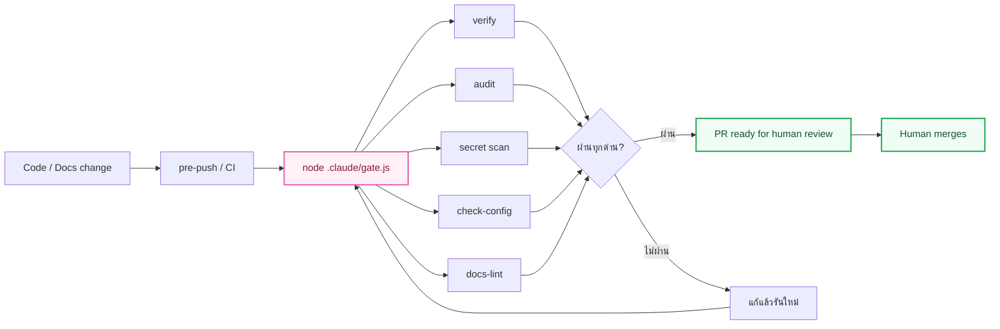

<div align="center">

<h1>🌸 Buaflow</h1>

<h3>เปลี่ยน Claude Code จาก “ผู้ช่วยเขียนโค้ด” ให้เป็นระบบส่งมอบซอฟต์แวร์ที่ตรวจสอบย้อนหลังได้</h3>

<p><strong>Plan อย่างมีหลักฐาน · Build อย่างมีขอบเขต · Verify ก่อนส่ง · คนเป็นผู้อนุมัติ</strong></p>

<p>
  
  
  
  
</p>

<p>
  <a href="#quick-start"><strong>เริ่มใช้งาน</strong></a>
  ·
  <a href="START-HERE.md"><strong>อ่าน START HERE</strong></a>
  ·
  <a href="UPGRADE.md"><strong>คู่มืออัปเกรด</strong></a>
  ·
  <a href="VERSION.md"><strong>Changelog</strong></a>
</p>

</div>

---

> **Buaflow คือ AI-native SDLC kit สำหรับ Claude Code** ที่เชื่อมตั้งแต่การค้นหา requirement, ตัดสินใจ stack, วาง architecture, แตก backlog, scaffold โปรเจกต์ ไปจนถึง workflow รายวัน, quality gate, PR และ feedback loop — โดยเก็บการตัดสินใจทุกช่วงไว้ใน Git

มันไม่ใช่ framework, starter app หรือ prompt ก้อนใหญ่ที่ยิงครั้งเดียวแล้วจบ แต่เป็น **ระบบปฏิบัติการของการทำงานร่วมกับ AI**: แต่ละขั้นมี input, output, gate และผู้รับผิดชอบชัดเจน สิ่งที่ห้ามพังถูกบังคับด้วยโค้ด ไม่ได้ฝากความหวังไว้กับข้อความใน prompt อย่างเดียว

## ภาพรวมใน 30 วินาที

| สิ่งที่มีให้ | จำนวน | หน้าที่ |
|---|:---:|---|
| **Lifecycle stages** | Phase 0–8 + Phase A | พาโปรเจกต์ใหม่จากโจทย์ไปถึง scaffold หรือรับช่วงโปรเจกต์เดิมผ่าน adoption track |
| **Skills** | 10 | workflow ตั้งแต่ `/intent` ถึง `/release` |
| **Rules** | 6 | โหลดกติกาตามชนิดไฟล์ที่กำลังแก้ ลด context ที่ไม่เกี่ยว |
| **Hooks** | 5 | บังคับ guardrail นอกบทสนทนาของ AI |
| **Subagents** | 3 | แยก context สำหรับ review, test และสำรวจ legacy code |
| **Config evals** | 4 | regression test ว่า AI และ config ยังทำตามข้อตกลง |
| **Document templates** | 16 | intent, spec, plan, task, ADR, constitution, review, design และอื่น ๆ |

### ปัญหาที่ Buaflow ตั้งใจแก้

- AI เขียนโค้ดเร็ว แต่ requirement, เหตุผล และขอบเขตหายไประหว่าง session
- กฎใน `CLAUDE.md` ดูดีแต่ไม่มีอะไรบังคับเมื่อ push จาก editor หรือใช้เครื่องมืออื่น
- คำว่า “เสร็จแล้ว” ไม่มี proof และตรวจซ้ำไม่ได้
- งานหลาย branch ชนกันเพราะ derived files ถูก commit หรือไม่รู้ว่าใคร claim งานอยู่
- context โตขึ้นทุกครั้งจน AI อ่านเอกสารเดิมซ้ำและใช้ token โดยไม่เพิ่มคุณภาพ
- UI “ดูคล้าย” design แต่ไม่มี baseline และตัวเลขบอกว่าต่างตรงไหน

### สิ่งที่ Buaflow เปลี่ยนให้

- การตัดสินใจถูกส่งต่อเป็น **artifact chain** ที่ค้นหาและ audit ได้
- กฎมี 4 ระดับ ตั้งแต่คำแนะนำไปถึง hook ที่บังคับจริง
- ทุกโปรเจกต์มี **verify command เดียว** และ **gate เดียว** สำหรับ local กับ CI
- จุดไม่ชัดต้องเป็น `[NEEDS CLARIFICATION: ...]` แทนการเดา
- AI เตรียมและตรวจงาน แต่ **ไม่ merge งานของตัวเองเข้า main**
- บทเรียนจากงานจริงย้อนกลับไปปรับ config ผ่าน Phase 8

---

## วงจรชีวิตของโปรเจกต์

```mermaid
flowchart LR
    START{เริ่มจากอะไร?}

    START -->|NEW / REBUILD| P0[Phase 0<br/>ตั้งต้น]
    P0 --> P1[1 Discovery]
    P1 --> P2[2 Stack]
    P2 --> P3[3 UI & Design]
    P3 --> P4[4 Architecture]
    P4 --> P5[5 Backlog]
    P5 --> P6[6 Scaffold]

    START -->|EXTEND| PA[Phase A<br/>Adopt existing]
    PA --> P7[7 Handoff]
    P6 --> P7

    P7 --> DAILY[Daily delivery loop]
    DAILY --> P8[8 Tune & Evolve]
    P8 -->|นำบทเรียนกลับเข้า config| DAILY

    classDef start fill:#fff1f5,stroke:#e85aad,color:#831843,stroke-width:2px;
    classDef phase fill:#f8fafc,stroke:#64748b,color:#0f172a;
    classDef run fill:#eff6ff,stroke:#2563eb,color:#1e3a8a,stroke-width:2px;
    classDef learn fill:#f0fdf4,stroke:#16a34a,color:#14532d,stroke-width:2px;
    class START start;
    class P0,P1,P2,P3,P4,P5,P6,PA,P7 phase;
    class DAILY run;
    class P8 learn;
```



| Phase | คำถามที่ตอบ | Artifact หลัก |
|:---:|---|---|
| **0** | กำลังสร้างใหม่, rebuild หรือ extend? ใช้ design จากไหน? | `docs/planning/_state.md` |
| **1** | ผู้ใช้คือใคร ต้องการอะไร อะไรคือ Must/NFR? | `01-requirements.md` |
| **2** | stack ใดเหมาะกับข้อจำกัดจริง และจะ verify ด้วยคำสั่งใด? | `02-tech-stack.md` + ADR |
| **3** | theme, token, component, viewport และ design source คืออะไร? | `03-ui-design.md` + design inventory |
| **4** | architecture, security, API, data model และ deployment boundary เป็นอย่างไร? | `04-architecture.md` + constitution + ADR |
| **5** | จะเปลี่ยน scope เป็น Epic / Feature / Task / milestone อย่างไร? | task files + roadmap |
| **6** | จะสร้างของจริงให้ build และ verify ผ่านได้อย่างไร? | source code + verify command |
| **7** | จะติดตั้ง rules, skills, hooks, gate, CI และ eval อย่างไร? | `AGENTS.md`, `CLAUDE.md`, `.claude/`, CI |
| **8** | config ส่วนใดช่วยจริง ส่วนใดสร้าง friction และควรเลื่อนชั้นกฎหรือไม่? | config/eval/changelog ที่ปรับจากหลักฐาน |
| **A** | โปรเจกต์เดิมทำงานอย่างไร และควรรับช่วงโดยไม่ refactor ทั้งโลกอย่างไร? | inventory + baseline verify + retrospective ADR |

> Phase A ใช้แทน Phase 1–6 สำหรับโหมด `EXTEND` แล้วเข้าสู่ Phase 7 เหมือนกัน

---

<a id="quick-start"></a>

## เริ่มใน 60 วินาที

### สิ่งที่ต้องมี

- [Claude Code](https://docs.anthropic.com/en/docs/claude-code/overview)
- Git
- Node.js สำหรับรัน gate, hooks และ core workflow scripts โดยไม่ต้องติดตั้ง package เพิ่ม; เฉพาะ visual regression (`pixel.js`) ที่ใช้ Playwright, pixelmatch และ pngjs จากโปรเจกต์เป้าหมาย
- โฟลเดอร์ `buaflow/` นี้วางอยู่ภายใน root ของโปรเจกต์เป้าหมาย

```text
your-project/
├── buaflow/       ← repository นี้
├── src/           ← โค้ดของโปรเจกต์ (ถ้ามี)
└── ...
```

เลือกเส้นทางเดียวที่ตรงกับสถานะปัจจุบัน:

### 1) โปรเจกต์ใหม่ หรือ rebuild

เปิด Claude Code ที่ root ของโปรเจกต์ แล้วพิมพ์:

```text
อ่าน buaflow/START-HERE.md แล้วทำตาม เริ่ม Phase 0
```

Claude จะถามโหมด, แหล่ง design, path อ้างอิง และชื่อโปรเจกต์ จากนั้นบันทึกสถานะลง `docs/planning/_state.md` ก่อนหยุดรอการตัดสินใจรอบถัดไป

### 2) มีโค้ดอยู่แล้ว แต่ยังไม่เคยใช้ Buaflow

ใช้ prompt เดียวกัน แล้วตอบโหมดเป็น `EXTEND`:

```text
อ่าน buaflow/START-HERE.md แล้วทำตาม เริ่ม Phase 0
```

ระบบจะพาเข้า [Phase A](phases/A-adopt-existing.md) เพื่อสำรวจของเดิม ตั้ง baseline verify และสร้างกติกาแบบ “ของใหม่ / ของเก่า” โดยไม่บังคับ rewrite โค้ดเดิมทั้งระบบ

### 3) ใช้ Buaflow เวอร์ชันเก่าอยู่แล้ว

วางโฟลเดอร์เวอร์ชันใหม่ทับ `buaflow/` เดิม แล้วพิมพ์:

```text
อ่าน buaflow/UPGRADE.md แล้วทำตาม
```

[UPGRADE.md](UPGRADE.md) แยก migration ตามเวอร์ชันและเก็บ planning, ADR, spec และ task เดิมไว้ ไม่ต้องเริ่ม Phase ใหม่ทั้งหมด

### กลับมาทำต่อใน session ใหม่

```text
อ่าน buaflow/START-HERE.md และ docs/planning/_state.md แล้วทำต่อจากที่ค้างไว้
```

หลักสำคัญคือ **ทำทีละ Phase** จบแล้วหยุด เพื่อให้ผู้ใช้ตรวจทิศทางได้ก่อน context จะพาโปรเจกต์ไกลเกินแก้

---

## Daily delivery loop หลัง Phase 7

```text
intent → spec → plan → task/code → verify → check → draft PR → human approval → done
   ↑                                                                     │
   └──────── incident / out-of-scope / postmortem / real-world lesson ──┘
```

| Skill | ใช้เมื่อ | สิ่งสำคัญที่เกิดขึ้น |
|---|---|---|
| `/intent <เรื่อง>` | เปิดงานใหม่ | จับ “ทำไม”, ผลลัพธ์ที่วัดได้ และสิ่งที่ห้ามพังก่อนคุย implementation |
| `/spec F-xx` | feature ใหญ่ | สร้าง `requirements.md` → `design.md` → `tasks.md` โดยมี approval gate ทุกช่วง |
| `/plan T-xxx` | งานหลายไฟล์, unfamiliar หรือเสี่ยง | บีบ AC, constitution และ design rule ที่เกี่ยวลง `plan.md` ไฟล์เดียว |
| `/task T-xxx` | เริ่มลงมือ | claim งาน, ตั้ง assignee, เปิด draft PR ตั้งแต่ต้น และวน implement/self-check |
| `/ui <หน้าหรือ component>` | สร้าง UI | ถามก่อนสร้าง เลือก text/canvas แล้วเทียบกับ baseline ตาม viewport/theme |
| `/prototype` | design พร้อม แต่ยังไม่ควร build app | สร้าง click-through prototype จาก artboard เดิมโดยไม่วาดหรือ restyle ใหม่ |
| `/check T-xxx` | โค้ดเสร็จก่อนขออนุมัติ | รัน verify, เทียบ diff กับ plan และเรียก code/security review ตามความเสี่ยง |
| `/done T-xxx` | ผู้ใช้อนุมัติแล้ว | รัน proof ซ้ำ, mark PR ready, ปิด task และเก็บบทเรียน — ไม่ merge เอง |
| `/hotfix` | production incident | บันทึกอาการ → หาสาเหตุ → แก้ → release → postmortem → feedback |
| `/release <uat\|prd> <M>` | ปิด milestone | gate, build image ครั้งเดียว, tag, release note และ rollback plan |

งานเล็กอย่าง typo, copy, log หรือ chore ใช้ **trivial track** ได้ ไม่ต้องลาก artifact chain เต็มชุด แต่ยังต้องตรวจและผ่าน PR ตามระดับความเสี่ยง

---

## Guardrail 4 ชั้น

Buaflow ไม่ใช้ไฟล์คำสั่งยักษ์ไฟล์เดียว แต่เลือกกลไกตามระดับความแข็งที่ต้องการ:

| ชั้น | ใช้กับ | โหลดเมื่อ | การบังคับ |
|---|---|---|---|
| **`AGENTS.md` / `CLAUDE.md`** | หลักการที่ต้องรู้ตลอด, ภาษา, workflow | ทุก session | แนวทางกลาง |
| **`.claude/rules/*.md`** | กฎเฉพาะ UI, API, migration, testing, i18n | เมื่อแตะ path ที่ตรง | แนวทางตรงจุด |
| **`.claude/skills/*/SKILL.md`** | ขั้นตอนที่ทำซ้ำและต้องมีลำดับ | เมื่อเรียก skill | workflow ที่ทำซ้ำได้ |
| **`.claude/hooks/` + gate** | กฎที่ห้ามพัง เช่น protected files, push เข้า main, config integrity | ตาม event และก่อน push/CI | **บังคับจริงด้วย exit code** |

หลักคิดคือ: ถ้าการละเมิดกฎทำให้ระบบเสียหายจริง กฎนั้นไม่ควรอยู่เป็นข้อความอย่างเดียว

### ประตูเดียวก่อนเข้า main



`gate.js` ใช้ชุดตรวจเดียวกันทั้ง local pre-push และ CI จึงลดปัญหา “ผ่านในเครื่อง แต่กฎบน CI เป็นคนละชุด” โดยโหมดของ audit และ secret scan ปรับได้ผ่าน `.claude/stack.json`

คำสั่งสำคัญหลังติดตั้ง Phase 7:

```bash
# ตรวจโค้ดด้วยคำสั่งมาตรฐานของโปรเจกต์
node .claude/verify.js

# ประตูเต็ม: verify + audit/secrets ตาม config + check-config + docs-lint
node .claude/gate.js

# commit ที่แก้เฉพาะเอกสาร
node .claude/gate.js --docs-only

# ตรวจเงื่อนไขปิด milestone เพิ่มเติม
node .claude/gate.js --release M1

# ตรวจสุขภาพ config โดยตรง
node .claude/check-config.js

# generate board จาก task files ซึ่งเป็น source of truth
node .claude/board.js
```

---

## Artifact chain: ตรวจย้อนกลับได้ตั้งแต่เหตุผลถึงการอนุมัติ

Buaflow ทำให้ทุกขั้นคายไฟล์ที่ขั้นถัดไปใช้ได้ และเก็บไว้ใน Git:

```text
Intent
  └─ ทำไมต้องทำ / วัดผลอย่างไร / อะไรห้ามพัง
      └─ Spec
          ├─ Requirements — ต้องการอะไร (EARS + acceptance criteria)
          ├─ Design       — จะออกแบบอย่างไร
          └─ Tasks        — แบ่งงานอย่างไร
              └─ Plan
                  └─ ข้อกำหนดที่คัดมาแล้วสำหรับ task นี้
                      └─ Diff + Proof + Verify
                          └─ Review + PR + Human approval
```

`plan.md` ทำหน้าที่เป็น **context compressor**: `/plan` อ่านต้นทางครบหนึ่งครั้ง แล้วคัดเฉพาะ AC, constitution articles, design rules และ patterns ที่ task ต้องใช้มาไว้ไฟล์เดียว จากนั้น `/task` และ `/check` ไม่ต้องย้อนอ่านเอกสารทั้งโครงการซ้ำ

เอกสารที่มี `[NEEDS CLARIFICATION: ...]` ค้างอยู่จะไม่ผ่าน gate เพราะความไม่แน่ใจควรถูกมองเห็นและตัดสิน ไม่ควรถูก AI เติมเองอย่างเงียบ ๆ

---

## Design → Prototype → Code ที่วัดผลได้

สำหรับโปรเจกต์เว็บ เส้นทาง design ของ Buaflow ครอบคลุมมากกว่า “แนบภาพแล้วพยายามทำให้คล้าย”:

1. สร้าง `design-brief.md` เพื่อระบุ theme, components, viewport, states และ deviation ที่ยอมรับได้
2. แยก canvas baseline เป็น `.dc.html` ต่อหน้า ไม่ใช้ลิงก์รวมเป็น build reference
3. สร้าง click-through prototype จาก artboard เดิมแบบ byte-for-byte แล้วฉีดเฉพาะ hotspot และ mock data
4. Build ของจริง **ทีละหน้า**
5. ถ่าย screenshot ที่ viewport/theme เดียวกันและรัน pixel diff
6. แก้จนเหลือเฉพาะ deviation ที่ผู้ใช้อนุมัติ แล้วอัปเดต baseline ให้ตรงกัน

เครื่องมือที่เกี่ยวข้อง:

| เครื่องมือ | ทำอะไร |
|---|---|
| `/ui` | คุมการสร้างหน้าหรือ component และห้ามออกแบบเองโดยไม่ถาม |
| `/prototype` + `prototype.js` | ทำ prototype จาก canvas baseline โดยไม่วาดใหม่ |
| `pixel.js` | เทียบ screenshot กับ baseline คืนเปอร์เซ็นต์และพิกัดที่ต่าง |
| `design-brief.tpl.md` | ล็อกข้อตกลงก่อนเปิด canvas |
| `prototype-flow.tpl.json` | map หน้าจอ, hotspot, state และ mock data |

เส้นทางนี้เป็นทางเลือก ไม่ได้บังคับกับ CLI, backend-only, desktop หรือโปรเจกต์ที่ไม่มี UI

---

## รองรับ stack แค่ไหน

Buaflow แบ่งการรองรับเป็น 2 ชั้นอย่างตั้งใจ:

| ชั้น | ระดับการรองรับ | รายละเอียด |
|---|---|---|
| **Process layer** | **ทุกภาษา / ทุก stack** | intent → spec → plan → task → check → done, board, docs lint, gate, hooks, PR policy, constitution และ eval ทำงานรอบโค้ด |
| **Ready-made stack layer** | **JS/TS + web เป็นหลัก** | rules และตัวอย่างบางส่วนอ้างถึง Next.js, Prisma, next-intl, shadcn และ pnpm |

สำหรับ Python, .NET, Go, Laravel หรือ stack อื่น ให้ใช้ [Phase A](phases/A-adopt-existing.md) และปรับ `.claude/stack.json`:

- `verifyCommand`
- `commands` เช่น coverage, audit, API test และ secret scan
- `codeFilePattern`, `testFilePattern`, `formattablePattern`
- `formatCommands`
- `preflightHookPath` และ `ciMode`
- `protected` paths

สคริปต์หลักอ่านค่าจากจุดเดียว จึงไม่ต้องไล่แก้ implementation ภายในทุกไฟล์ แต่ **rules เฉพาะ stack ต้องเขียนให้ตรง convention ของโปรเจกต์จริง** — kit ไม่แกล้งอ้างว่ามี preset ที่ยังไม่เคยพิสูจน์

### สิ่งที่ Buaflow ตั้งใจไม่ทำ

- ไม่สร้าง agent ตามตำแหน่ง PM / QA / Architect เพื่อจำลองบริษัททั้งบริษัทใน context เดียว
- ไม่ให้ AI อนุมัติหรือ merge งานของตัวเอง
- ไม่บังคับ rewrite legacy code ให้ตรงมาตรฐานใหม่ทั้งหมด
- ไม่เดา deploy target, requirement หรือ design ที่ผู้ใช้ยังไม่ตัดสินใจ
- ไม่ผูก workflow หลักกับ package manager หรือ framework ชื่อใดชื่อหนึ่ง
- ไม่ทำ pixel diff ใน pre-push gate เพราะต้องเปิด app/browser และช้าเกินไปสำหรับทุก push

---

## โครงสร้าง repository

<details>
<summary><strong>เปิดดูแผนที่ไฟล์ทั้งหมด</strong></summary>

```text
buaflow/
├── README.md                         เอกสารภาพรวม
├── START-HERE.md                     prompt หลักและตัวคุม flow
├── UPGRADE.md                        migration guide ระหว่างเวอร์ชัน
├── VERSION.md                        changelog
│
├── phases/
│   ├── 01-discovery.md               requirement, MoSCoW, NFR
│   ├── 02-stack-decision.md          stack และ verify strategy
│   ├── 03-ui-and-design-intake.md    UI source, theme, token, inventory
│   ├── 04-architecture.md            architecture, security, data, API
│   ├── 05-backlog-and-roadmap.md     Epic / Feature / Task / milestone
│   ├── 06-scaffold.md                สร้างโปรเจกต์จริง
│   ├── 07-handoff.md                 ติดตั้ง config + CI + eval
│   ├── 08-tune-and-evolve.md         feedback loop ที่ทำซ้ำ
│   └── A-adopt-existing.md           รับช่วงโปรเจกต์ที่มีโค้ดอยู่แล้ว
│
├── standards/
│   ├── agent-config.md               เลือกชั้น AGENTS / rules / skills / hooks
│   ├── workflow-lifecycle.md         วงจรงานและการ release
│   ├── definition-of-done.md         เกณฑ์จบงาน
│   ├── testing-and-coverage.md       test strategy และ coverage
│   ├── security-checklist.md         security baseline
│   ├── ui-component-rules.md         UI และ visual verification
│   ├── i18n-and-theme.md             ภาษาและ theme
│   ├── commit-and-branch.md          Git workflow
│   ├── docker-and-envs.md            container และ environment
│   ├── sonarqube-local.md            static analysis
│   └── context-budget.md             token/context strategy
│
├── templates/
│   ├── intent.tpl.md
│   ├── spec.tpl.md
│   ├── plan.tpl.md
│   ├── task.tpl.md
│   ├── adr.tpl.md
│   ├── constitution.tpl.md
│   ├── REVIEW.tpl.md
│   ├── AGENTS.md.tpl
│   ├── CLAUDE.md.tpl
│   ├── design-brief.tpl.md
│   ├── prototype-flow.tpl.json
│   ├── eval-case.tpl.md
│   ├── backlog-board.tpl.md
│   ├── verify.mjs.tpl
│   └── ...
│
└── claude-setup/                     คัดลอกไปเป็น .claude/ ใน Phase 7
    ├── skills/                       10 reusable workflows
    ├── rules/                        6 path-scoped rules
    ├── agents/                       3 context-isolated agents
    ├── hooks/                        5 enforcement hooks
    ├── evals/                        4 config regression cases
    ├── ci/                           GitHub Actions / GitLab CI / Git hooks
    ├── stack.json                    single source of stack config
    ├── stack-config.js               shared config loader
    ├── verify.js                     verify entry point
    ├── gate.js                       pre-push / CI quality gate
    ├── check-config.js               config health check
    ├── docs-lint.js                  artifact integrity check
    ├── board.js                      task files → generated board
    ├── prototype.js                  canvas → click-through prototype
    ├── pixel.js                      screenshot diff
    └── run.js                        named command runner
```

</details>

### สิ่งที่โปรเจกต์ได้รับหลัง Phase 7

```text
your-project/
├── AGENTS.md                         กติกาหลักแบบไม่ผูก vendor
├── CLAUDE.md                         ชั้นบางสำหรับ Claude Code
├── REVIEW.md                         นโยบาย review
├── CONTRIBUTING.md
├── .claude/
│   ├── skills/  rules/  agents/  hooks/
│   ├── stack.json
│   ├── settings.json
│   ├── verify.js  gate.js  check-config.js
│   ├── docs-lint.js  board.js  run.js
│   └── prototype.js  pixel.js
├── .husky/
│   ├── pre-push                      เรียก gate
│   ├── post-merge                    refresh board
│   └── post-checkout                 refresh board
├── .github/workflows/gate.yml        หรือ .gitlab-ci.yml
├── docs/
│   ├── constitution.md
│   ├── planning/  intents/  specs/  plans/
│   ├── backlog/tasks/  adr/  evals/
│   ├── design/  incidents/  releases/  api/
│   └── standards/  templates/
├── scripts/verify.mjs
├── docker-compose.dev.yml
└── sonar-project.properties
```

`docs/backlog/tasks/*.md` คือ source of truth ของงาน ส่วน `board.md` เป็น derived view ที่ generate ใหม่ได้และไม่ commit จึงไม่กลายเป็น conflict กลางหลาย PR

---

## หลักการที่ยึดไว้

1. **Artifact ต่อกันเป็นทอด** — ทุกขั้นมีของส่งต่อที่อ่านและตรวจย้อนกลับได้
2. **Configuration is control** — กฎสำคัญต้องมี enforcement ที่เหมาะกับความเสี่ยง
3. **Verify before visibility** — AI ต้องตรวจงานตัวเองได้ก่อนเอาไปให้คนดู
4. **No silent guessing** — ความไม่ชัดต้องถูกทำเครื่องหมายและกลับไปถาม
5. **Humans at gates** — คนตัดสินใจที่จุดรับความเสี่ยง ไม่ต้องนั่งเฝ้าทุกคำสั่ง
6. **One phase at a time** — ลด context drift และเปิดทางให้แก้ทิศได้เร็ว
7. **Compress, do not cascade** — ขั้นถัดไปอ่าน artifact ที่คัดแล้ว ไม่แบกเอกสารทั้งหมดต่อกันไป
8. **Learn from production** — incident และ friction ต้องย้อนกลับเป็น config หรือ eval ที่ป้องกันการเกิดซ้ำ

---

## ที่มาของแนวทาง

Buaflow สังเคราะห์แนวคิดจาก:

- **Anthropic — AI-Native SDLC Playbook**: artifact chain, configuration as control, feedback loop และ tiered autonomy
- **Claude Code**: skills, rules, hooks, subagents, built-in review และ context management
- **GitHub Spec Kit**: constitution, clarification markers และ gate ระหว่างขั้น
- **AWS Kiro**: requirements/design/tasks spec, EARS notation และ path-scoped steering
- **AGENTS.md**: กติกากลางที่เครื่องมือหลายค่ายอ่านร่วมกันได้

Buaflow นำแนวคิดเหล่านี้มาประกอบเป็น workflow เดียวที่เน้น **traceability, enforceability และ human judgment** มากกว่าการเพิ่มจำนวน agent หรือเพิ่มพิธีกรรม

---

<h3 align="center">พร้อมเริ่มแล้ว?</h3>

<p align="center">เปิด Claude Code ที่ root ของโปรเจกต์ แล้วส่งประโยคนี้:</p>

```text
อ่าน buaflow/START-HERE.md แล้วทำตาม เริ่ม Phase 0
```

<p align="center"><strong>Build fast. Verify everything. Let humans decide what matters.</strong> 🌸</p>

<p align="center">
  <a href="START-HERE.md">เริ่มจาก START-HERE.md</a>
  ·
  <a href="UPGRADE.md">อัปเกรดเวอร์ชันเดิม</a>
  ·
  <a href="VERSION.md">ดูสิ่งที่เปลี่ยน</a>
</p>
