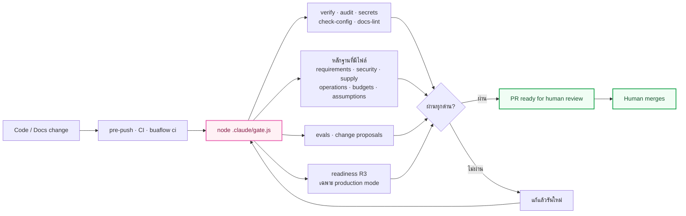

<div align="center">

<h1>🌸 Buaflow</h1>

<h3>Claude Code เป็นคนสร้าง · Buaflow เป็นคนพิสูจน์ว่าแอปพร้อมส่งมอบแค่ไหน</h3>

<p><strong>Plan อย่างมีหลักฐาน · Build อย่างมีขอบเขต · ตัดสินความพร้อมด้วยเครื่อง · คนเป็นผู้อนุมัติ</strong></p>

<p>
  
  
  
  
</p>

<p>
  <a href="QUICKSTART.md"><strong>10 นาทีแรก</strong></a>
  ·
  <a href="START-HERE.md"><strong>START HERE</strong></a>
  ·
  <a href="CLI.md"><strong>CLI</strong></a>
  ·
  <a href="UPGRADE.md"><strong>อัปเกรด</strong></a>
  ·
  <a href="TROUBLESHOOTING.md"><strong>แก้ปัญหา</strong></a>
  ·
  <a href="VERSION.md"><strong>Changelog</strong></a>
</p>

</div>

---

> **Buaflow นำโปรเจกต์ — ไม่ว่าจะเริ่มใหม่หรือมีโค้ดอยู่แล้ว — จากโจทย์ไปสู่ Production Candidate (R3):**
> repository ที่ทีม platform สามารถนำไปติดตั้งได้โดย**ไม่ต้องแก้ไข source code** เหลือเพียงกำหนดค่า secret และค่าของ infrastructure
> และสามารถตอบได้ทุกเมื่อว่าแอปอยู่ในระดับใด **จากหลักฐานที่ตรวจสอบซ้ำได้ด้วยเครื่อง** ไม่ใช่จากคำกล่าวอ้างของ AI

AI สามารถเขียนโค้ดได้รวดเร็วและมีประสิทธิภาพสูงขึ้นทุกเดือน แต่สิ่งที่ยังขาดคือ**คำตอบที่เชื่อถือได้ว่างานเสร็จสมบูรณ์มากน้อยเพียงใด** Buaflow จึงไม่ได้แข่งขันกับ AI
ในการเขียนโค้ด ไม่มี template generator และไม่คัดลอกเอกสารของผู้ให้บริการมาเก็บไว้ล่วงหน้า — Claude Code เป็นผู้เลือกเครื่องมือ
อ่านเอกสารฉบับปัจจุบัน และดำเนินการเอง ส่วน Buaflow ยึดถือสามหลักการที่ไม่ควรปล่อยให้ AI ตัดสินใจเอง:

1. **ขอบเขตและการตัดสินใจ** — intent, requirement, เงื่อนไขที่ต้องไม่ถูกละเมิด และสมมติฐานทุกข้อ จัดเก็บใน Git พร้อมเจ้าของที่ชัดเจน
2. **กลไกบังคับใช้จริง** — hook และ gate ที่ exit non-zero ได้จริง ทั้งในเครื่องและนอก session
3. **คำตัดสินความพร้อม** — readiness R0–R4 จากหลักฐาน, verifier ที่ไม่เชื่อคำประกาศของผู้สร้าง และคะแนนที่ไม่มีช่องให้กรอกเอง

## การเปลี่ยนแปลงจาก v2.3.4

v2.x คือ **SDLC workflow สำหรับทำงานกับ AI** — phase, skill, rule, hook และ gate · v3.x เก็บทั้งหมดนั้นไว้
แล้วเพิ่มคำตอบของคำถามที่ v2 ตอบไม่ได้: **"แล้วตอนนี้พร้อมส่งมอบหรือยัง"**

| | v2.3.4 | v3.17.1 |
|---|---|---|
| เป้าหมาย | ทำงานกับ AI อย่างมีระเบียบ | ส่งมอบแอปที่พิสูจน์ความพร้อมได้ถึง R3 |
| "เสร็จแล้ว" | verify + gate ผ่าน | + readiness manifest ที่ผูกกับ commit และถูก verifier ตรวจซ้ำ |
| โปรเจกต์เดิม | Phase A ด้วยมือ | `buaflow assess` ตอบระดับ R ได้ทันทีโดยไม่ต้องเขียนอะไรก่อน |
| หลักฐาน | prose ในเอกสาร | JSON ที่มี schema + ตัวตรวจ: requirement/exception, security (OWASP ASVS), supply chain, restore ที่ซ้อมจริง, budget |
| วัดผล config ของ AI | eval แบบ Markdown ที่คนกรอกผลเอง | eval harness ที่ตรึงเวอร์ชันเคส และคนเขียนเคสตรวจเคสตัวเองไม่ได้ |
| CI | ต้องมี hosted CI | `buaflow ci` — gate จาก clean checkout บนเครื่องตัวเอง ใช้เป็นหลักฐาน R2 ได้ |
| ติดตั้ง | clone โฟลเดอร์ แล้ว AI คัดลอก `claude-setup/` ทีละไฟล์ | Claude Code plugin ที่มี kit ทั้งชุด + `/buaflow:start` · `buaflow install` วางของที่ต้องอยู่ในโปรเจกต์ โดยไม่ทับไฟล์ที่ทีมแก้เอง |
| พิสูจน์ด้วยอะไร | — | reference app 3 ตัวผ่าน R3 ใน clean environment + trial บนโปรเจกต์จริงที่ kit ไม่ได้เขียน |

อัปเกรดจากรุ่นใดก็ได้ในรอบเดียว → [UPGRADE.md](UPGRADE.md#fast-path) · รายละเอียดทุกรุ่น → [VERSION.md](VERSION.md)

---

## ภาพรวมโดยสรุป

| องค์ประกอบ | จำนวน | หน้าที่ |
|---|:---:|---|
| **Lifecycle** | Phase 0–8 + Phase A | พาโปรเจกต์ใหม่จากโจทย์ไปถึง scaffold หรือรับช่วงโปรเจกต์เดิม |
| **Skills** | 11 | workflow ตั้งแต่ `/intent` ถึง `/release` |
| **Rules / Hooks / Subagents** | 6 / 5 / 3 | กฎตามชนิดไฟล์ · guardrail นอกบทสนทนา · review/test/สำรวจ legacy แยก context |
| **CLI (`buaflow`)** | 20 คำสั่ง | `assess`, `ci`, `benchmark`, `audit`, `install`, `lock` และตัวตรวจหลักฐานทุกชนิด — ใช้ได้จาก terminal, hook และ CI |
| **Readiness** | R0–R4 · 28 control | ระดับความพร้อมที่ตัดสินจากหลักฐาน ไม่ใช่จากความรู้สึก |
| **Schemas** | 21 ชนิด | สัญญาของ artifact ที่เครื่องอ่าน พร้อม registry และ migration |
| **Stack packs** | 3 + 2 capability | recipe + assertion ที่ผูกกับ reference app ที่พิสูจน์มันจริง |
| **Templates** | 36 | intent, spec, plan, task, ADR, constitution, evidence records และอื่น ๆ |

---

## Readiness: คำว่า "พร้อม" มีความหมายเดียว

| Level | ความหมาย | ตอบคำถาม |
|---|---|---|
| **R0** Prototype | เปิดดูหรือทดลอง flow ได้ | แนวคิดสื่อสารได้หรือยัง |
| **R1** Functional | happy path หลักทำงาน build และ verify ผ่าน | ฟังก์ชันหลักมีจริงหรือยัง |
| **R2** MVP | persistence, access control, automated test และ CI จาก clean checkout | ให้ผู้ใช้กลุ่มจำกัดทดลองได้หรือยัง |
| **R3** Production Candidate | security, migration, rollback, observability, runbook, SBOM และ deploy artifact ครบ | ส่งทีม platform ติดตั้งได้โดยไม่แก้โค้ดหรือยัง |
| **R4** Regulated | ผ่าน control pack ขององค์กร/อุตสาหกรรม | พร้อมกับข้อกำกับเฉพาะหรือยัง |

```bash
node buaflow/bin/buaflow.js assess              # อยู่ระดับไหนตอนนี้ — probe repo เอง ไม่ต้องเขียนอะไรก่อน
node buaflow/bin/buaflow.js readiness --level R3 # ตัดสิน manifest ที่ผูกกับ commit
node buaflow/bin/buaflow.js audit --level R3     # verifier ตรวจหลักฐานซ้ำ: confirmed / refuted / unverifiable
node buaflow/bin/buaflow.js benchmark            # functional · engineering · operations → Production-Qualified ไหม
```

หลักเกณฑ์ที่ทำให้ระดับความพร้อมนี้เชื่อถือได้: หลักฐานต้องตรวจสอบซ้ำได้และผูกกับ commit · หลักฐานที่เก่าเกินหน้าต่างเวลาที่ผู้ตรวจกำหนดจะมีสถานะ `EXPIRED` ·
ช่องโหว่ที่ยอมรับได้ต้องบันทึกเป็น exception ที่มีเจ้าของและวันหมดอายุ ไม่ใช่ระบุเป็น `pass` · การแนบ screenshot เพียงอย่างเดียวไม่ถือเป็นหลักฐานที่เพียงพอ
รายละเอียดอยู่ใน [standards/readiness-levels.md](standards/readiness-levels.md) และ
[standards/production-qualified-benchmark.md](standards/production-qualified-benchmark.md)
(ซึ่งเขียนไว้ด้วยว่าตัวเลขนี้**มองไม่เห็นอะไร**)

---

## วงจรชีวิตของโปรเจกต์

```mermaid
flowchart LR
    START{เริ่มจากอะไร?}

    START -->|NEW / REBUILD| P0[Phase 0<br/>ตั้งต้น]
    P0 --> P1[1 Discovery]
    P1 --> P2[2 Stack]
    P2 --> P3[3 UI & Design]
    P3 --> P4[4 Architecture]
    P4 --> P5[5 Backlog]
    P5 --> P6[6 Scaffold]

    START -->|EXTEND| PA[Phase A<br/>assess + adopt]
    PA --> P7[7 Handoff]
    P6 --> P7

    P7 --> DAILY[Daily delivery loop]
    DAILY --> EVID[Evidence → R2 → R3]
    DAILY --> P8[8 Tune & Evolve]
    P8 -->|บทเรียน → config + eval| DAILY

    classDef start fill:#fff1f5,stroke:#e85aad,color:#831843,stroke-width:2px;
    classDef phase fill:#f8fafc,stroke:#64748b,color:#0f172a;
    classDef run fill:#eff6ff,stroke:#2563eb,color:#1e3a8a,stroke-width:2px;
    classDef learn fill:#f0fdf4,stroke:#16a34a,color:#14532d,stroke-width:2px;
    class START start;
    class P0,P1,P2,P3,P4,P5,P6,PA,P7 phase;
    class DAILY,EVID run;
    class P8 learn;
```



| Phase | คำถามที่ตอบ | Artifact หลัก |
|:---:|---|---|
| **0** | สร้างใหม่, rebuild หรือ extend? ใช้ design จากไหน? | `docs/planning/_state.md` |
| **1** | ผู้ใช้คือใคร ต้องการอะไร อะไรคือ Must/NFR? | `01-requirements.md` |
| **2** | stack ใดเหมาะกับข้อจำกัดจริง และจะ verify ด้วยคำสั่งใด? | `02-tech-stack.md` + ADR |
| **3** | theme, token, component, viewport และ design source คืออะไร? | `03-ui-design.md` + design inventory |
| **4** | architecture, security, API, data model และ deployment boundary? | `04-architecture.md` + constitution + ADR |
| **5** | จะเปลี่ยน scope เป็น Epic / Feature / Task / milestone อย่างไร? | task files + roadmap |
| **6** | จะสร้างของจริงให้ build และ verify ผ่านได้อย่างไร? | source code + verify command |
| **7** | จะติดตั้ง rules, skills, hooks, gate, CI และ eval อย่างไร? | `AGENTS.md`, `CLAUDE.md`, `.claude/`, CI |
| **8** | config ส่วนใดช่วยจริง ส่วนใดสร้าง friction? | change proposal ที่พิสูจน์ด้วย eval |
| **A** | โปรเจกต์เดิมอยู่ระดับไหน และรับช่วงโดยไม่รื้อทั้งระบบอย่างไร? | `assess` + inventory + baseline verify + ADR ย้อนหลัง |

> Phase A ใช้แทน Phase 1–6 สำหรับโหมด `EXTEND` แล้วเข้าสู่ Phase 7 เหมือนกัน

---

<a id="quick-start"></a>

## เริ่มใช้งาน

> ใหม่กับ kit? [QUICKSTART.md](QUICKSTART.md) พาไป 10 นาทีแรกด้วยคำสั่งจริง ·
> ทุกขั้นพร้อม output จริง [examples/worked-sample.md](examples/worked-sample.md)

**สิ่งที่ต้องมี:** [Claude Code](https://docs.anthropic.com/en/docs/claude-code/overview) · Git · Node.js **22+**
(kit ไม่มี dependency — ไม่ต้อง `npm install`)

### วิธีที่แนะนำ: ติดตั้งผ่าน plugin โดยไม่ต้อง clone repository

เปิด Claude Code ที่ root ของโปรเจกต์ แล้วพิมพ์:

```text
/plugin marketplace add Khattiya01/buaflow-plugin
/plugin install buaflow@buaflow
/buaflow:start
```

> **หากใช้ Claude Code ภายใน VS Code:** extension จะแสดงข้อความ `/plugin isn't available in this environment` — ให้ติดตั้งจาก terminal แทน
> (`claude plugin marketplace add Khattiya01/buaflow-plugin` แล้ว `claude plugin install buaflow@buaflow`) จากนั้นเปิด session ใหม่แล้วพิมพ์ `/buaflow:start`

`/buaflow:start` ตรวจสอบสถานะของโปรเจกต์และเลือกแนวทางที่เหมาะสมให้โดยอัตโนมัติ:

| โปรเจกต์ | สิ่งที่เกิดขึ้น |
|---|---|
| ใหม่ หรือ rebuild | Phase 0 → ถามโหมด แหล่ง design และชื่อโปรเจกต์ แล้วไปทีละ Phase หยุดทุกครั้งที่จบ |
| มีโค้ดอยู่แล้ว | รัน `doctor` + `assess` บอกระดับ R ปัจจุบันก่อน แล้วเข้า [Phase A](phases/A-adopt-existing.md) **โดยไม่แก้โค้ดโปรดักชัน** |
| ติดตั้ง Buaflow แล้ว | ทำต่อจากที่ค้าง · ถ้าติดตั้งรุ่นเก่าไว้ พาทำ [ทางลัดอัปเกรด](UPGRADE.md#fast-path) |

plugin ถือ kit ทั้งชุด (START-HERE, phases, standards, templates, CLI) พร้อม skills, agents และ hooks · ถึง Phase 7 มันรัน
`buaflow install --plugin --write` วาง **gate และตัวตรวจลง `.claude/` ของโปรเจกต์** เพราะ pre-push และ CI รันนอก Claude
บนเครื่องที่ไม่มี plugin · ส่วน permission, rules และ `stack.json` ก็อยู่ในโปรเจกต์เพราะปรับตามโปรเจกต์ ·
เพื่อนร่วมทีมแต่ละคนรัน `/plugin install buaflow@buaflow` ครั้งเดียว (marketplace ถูกเพิ่มให้จาก settings ของโปรเจกต์)
— [claude-plugin/README.md](claude-plugin/README.md)

### วิธีอื่น: วางโฟลเดอร์ `buaflow/` ในโปรเจกต์

```text
your-project/
├── buaflow/       ← git clone repository นี้
├── src/           ← โค้ดของโปรเจกต์ (ถ้ามี)
└── ...
```

```text
อ่าน buaflow/START-HERE.md แล้วทำตาม เริ่ม Phase 0
```

มีโค้ดอยู่แล้ว → รัน `node buaflow/bin/buaflow.js assess` ก่อนเพื่อรู้ระดับ R แล้วตอบโหมดเป็น `EXTEND` ·
ใช้รุ่นเก่าอยู่ → วางเวอร์ชันใหม่ทับแล้วพิมพ์ `อ่าน buaflow/UPGRADE.md แล้วทำตาม` (planning, ADR, spec, task เดิมอยู่ครบ)

### การทำงานต่อใน session ใหม่

`/buaflow:start` (plugin) หรือ:

```bash
node buaflow/bin/buaflow.js resume
```

---

## Daily delivery loop หลัง Phase 7

```text
intent → (elaborate) → spec → plan → task/code → verify → check → draft PR → human approval → done
   ↑                                                                     │
   └──── incident / out-of-scope / postmortem / change proposal + eval ─┘
```

| Skill | ใช้เมื่อ | สิ่งสำคัญที่เกิดขึ้น |
|---|---|---|
| `/intent <เรื่อง>` | เปิดงานใหม่ | จับ "ทำไม", ผลลัพธ์ที่วัดได้ และสิ่งที่ห้ามพังก่อนคุย implementation |
| `/elaborate I-0xx` | ลูกค้าให้ requirement มาคร่าว ๆ (`brief: open`) | หาเป้าหมายจริง research โดเมน แล้วเสนอสิ่งที่คำขอยังขาด พร้อมแหล่งที่มา ให้คนตัดสินเป็นกลุ่ม · ข้อที่รับเข้า spec โดยอ้าง `E-xx` |
| `/spec F-xx` | feature ใหญ่ | `requirements.md` (EARS) → `design.md` → `tasks.md` โดยมี approval gate ทุกช่วง · การเดาลง assumption ledger |
| `/plan T-xxx` | งานหลายไฟล์ หรือเสี่ยง | บีบ AC, constitution และ design rule ที่เกี่ยวลง `plan.md` ไฟล์เดียว |
| `/task T-xxx` | เริ่มลงมือ | claim งาน เปิด draft PR วน implement/self-check ภายใต้งบ repair loop ตามชนิดความล้มเหลว |
| `/ui <หน้าหรือ component>` | สร้าง UI | ถามก่อนสร้าง แล้วเทียบกับ baseline ตาม viewport/theme |
| `/prototype` | design พร้อม แต่ยังไม่ควร build | click-through prototype จาก artboard เดิมโดยไม่วาดใหม่ |
| `/check T-xxx` | โค้ดเสร็จก่อนขออนุมัติ | รัน verify เทียบ diff กับ plan และเรียก code/security review ตามความเสี่ยง |
| `/done T-xxx` | ผู้ใช้อนุมัติแล้ว | รัน proof ซ้ำ mark PR ready ปิด task — **ไม่ merge เอง** |
| `/hotfix` | production incident | อาการ → สาเหตุ → แก้ → release → postmortem → feedback |
| `/release <uat\|prd> <M>` | ปิด milestone | gate, build image ครั้งเดียว, tag, release note และ rollback plan |

งานขนาดเล็ก เช่น typo, copy หรือ chore สามารถใช้ **trivial track** ได้ โดยไม่ต้องผ่าน artifact chain เต็มรูปแบบ แต่ยังคงต้องผ่าน PR ตามระดับความเสี่ยง
สำหรับผู้ที่ไม่ได้ใช้ Claude Code: [manual/](manual/README.md) คือ workflow เดียวกันในรูปแบบ playbook พร้อมระบุอย่างชัดเจนว่าการรับประกันส่วนใดขาดหายไป

---

## Guardrail 4 ชั้น

| ชั้น | ใช้กับ | โหลดเมื่อ | การบังคับ |
|---|---|---|---|
| **`AGENTS.md` / `CLAUDE.md`** | หลักการที่ต้องรู้ตลอด, ภาษา, workflow | ทุก session | แนวทางกลาง |
| **`.claude/rules/*.md`** | กฎเฉพาะ UI, API, migration, testing, i18n | เมื่อแตะ path ที่ตรง | แนวทางตรงจุด |
| **`.claude/skills/*/SKILL.md`** | ขั้นตอนที่ทำซ้ำและต้องมีลำดับ | เมื่อเรียก skill | workflow ที่ทำซ้ำได้ |
| **`.claude/hooks/` + gate** | protected files, push เข้า main, คำสั่งอันตราย, config integrity | ตาม event และก่อน push/CI | **บังคับจริงด้วย exit code** |

หากการละเมิดกฎอาจทำให้ระบบเสียหายจริง กฎนั้นไม่ควรอยู่ในรูปข้อความเพียงอย่างเดียว

### ด่านตรวจเดียวก่อนเข้า main



`gate.js` ชุดเดียวกันรันทั้ง pre-push, hosted CI และ `buaflow ci` (clean checkout บนเครื่อง ไม่ต้องจ่ายค่า runner)
ตัวตรวจหลักฐานทำงานเฉพาะเมื่อโปรเจกต์มีไฟล์นั้น — เริ่มใช้ทีละชิ้นได้ · verify ที่ตกแล้วผ่านเมื่อรันซ้ำโดยไม่มีอะไรเปลี่ยน
ถูกรายงานว่า **FLAKY** แทนที่จะสอนให้กด retry

| `assuranceMode` | ใช้เมื่อ | พฤติกรรม |
|---|---|---|
| `adoption` (ค่าเริ่มต้น) | กำลังติดตั้ง/รับช่วงโปรเจกต์เดิม | ของที่ยังไม่พร้อม `skip`/`warn` พร้อมรายงาน gap |
| `production` | จะอ้าง R3/R4 | fail-closed: verify, audit, secret scan และ readiness manifest ต้องมีและผ่าน · ห้าม `--docs-only` |

```bash
node .claude/gate.js                 # ประตูเต็ม
node .claude/gate.js --docs-only     # commit ที่แก้เฉพาะเอกสาร (adoption mode เท่านั้น)
node .claude/gate.js --release M1    # เงื่อนไขปิด milestone
node buaflow/bin/buaflow.js ci       # gate จาก clean checkout → docs/evidence/ci-run.json
node .claude/board.js                # generate board จาก task files
```

---

## หลักฐานที่ตรวจได้

แต่ละชนิดมี schema, template และตัวตรวจที่ **derive ค่าใหม่เอง** แทนการเชื่อตัวเลขที่เขียนไว้ใน record

| หลักฐาน | ตอบคำถาม | คำสั่ง |
|---|---|---|
| `readiness.json` | อยู่ R ไหน ผูกกับ commit ไหน | `buaflow readiness` · `buaflow audit` |
| `requirement-coverage.json` | requirement ทุกข้อมี proof หรือ exception ที่ยังไม่หมดอายุ | `buaflow requirements` |
| `security-baseline.json` | threat boundary + ทุกข้อของ OWASP ASVS 5.0 L1 มีคำตอบ | `buaflow security` |
| `supply-chain.json` | licence (derive จาก SBOM), provenance, checksum | `buaflow supply` |
| `operational-readiness.json` | restore ที่ซ้อมจริงจนข้อมูลกลับมาเหมือนเดิม + incident hook | `buaflow operations` |
| `budgets.json` | performance/accessibility เทียบเพดานของ application profile | `buaflow budgets` |
| `assumptions.json` | การเดาทุกข้อมีเจ้าของ วันหมดอายุ และวิธีพิสูจน์ | `buaflow assumptions` |
| `docs/evals/` | config ของ AI ยังทำตามข้อตกลง — ตรวจโดยคนที่ไม่ใช่คนเขียนเคส | `buaflow evals` |
| `changes/` | การแก้ config แต่ละครั้งมีหลักฐานและ eval ที่ไม่ถดถอย | `buaflow changes` |
| `ci-run.json` | gate ผ่านจาก clean checkout | `buaflow ci` |

---

## Artifact chain: ตรวจย้อนกลับได้ตั้งแต่เหตุผลถึงการอนุมัติ

```text
Intent — ทำไม / วัดผลอย่างไร / อะไรห้ามพัง
  └─ Spec — requirements (EARS) · design · tasks
      └─ Plan — ข้อกำหนดที่คัดมาแล้วสำหรับ task นี้
          └─ Diff + Proof + Verify
              └─ Review + PR + Human approval
                  └─ Evidence → Readiness
```

`plan.md` เป็น **context compressor**: อ่านต้นทางครบครั้งเดียว แล้ว `/task` และ `/check` ไม่ต้องย้อนอ่านทั้งโครงการ

ความไม่ชัดต้องเป็น `[NEEDS CLARIFICATION (security): …]` — บอกว่าคำตอบเปลี่ยนการตัดสินใจเรื่องไหน และมีงบ 8 คำถามต่อไฟล์
เอกสารที่ยังมี marker ค้างไม่ผ่าน gate · การเดาที่จำเป็นต้องทำเพื่อเดินต่อไปอยู่ใน assumption ledger ที่มีวันหมดอายุ

---

## Design → Prototype → Code ที่วัดผลได้

สำหรับโปรเจกต์ที่มี UI: `design-brief.md` ล็อกข้อตกลง → canvas baseline `.dc.html` ต่อหน้า →
click-through prototype จาก artboard เดิมแบบ byte-for-byte → build ทีละหน้า → screenshot ที่ viewport/theme เดียวกัน
แล้ว `pixel.js` คืนเปอร์เซ็นต์และพิกัดที่ต่าง → แก้จนเหลือเฉพาะ deviation ที่อนุมัติ

เครื่องมือ: `/ui` · `/prototype` + `prototype.js` · `pixel.js` · `design-brief.tpl.md` · `prototype-flow.tpl.json`
เส้นทางนี้เป็นทางเลือก ไม่บังคับกับ CLI, backend-only หรือโปรเจกต์ที่ไม่มี UI · ไม่อยู่ใน pre-push gate เพราะช้าเกินไปสำหรับทุก push

---

## ขอบเขตการรองรับ stack และหลักฐานที่พิสูจน์แล้ว

| ชั้น | ระดับ | รายละเอียด |
|---|---|---|
| **Process + evidence** | **ทุกภาษา / ทุก stack** | workflow, gate, hooks, readiness, verifier และตัวตรวจหลักฐานอ่านค่าจาก `.claude/stack.json` จุดเดียว |
| **Golden paths** | **3 stack ที่ผ่าน R3 จริง** | recipe + assertion ใน [packs/](packs/README.md) ผูกกับ reference app ที่พิสูจน์มัน |

| Reference app | stack | ผล |
|---|---|---|
| `nextjs-postgres-crud` | Next.js + PostgreSQL | R3 · benchmark 0.97 |
| `react-fastapi-postgres-crud` | React + FastAPI + PostgreSQL | R3 · benchmark 0.97 |
| `expo-fastapi-postgres-sync` | Expo (offline-first) + FastAPI sync API | R3 · benchmark 0.97 |
| โปรเจกต์จริงที่ kit ไม่ได้เขียน | brownfield monorepo | Phase A ครบ · R2 ผ่านด้วย local CI · ข้อค้นพบ 17 ข้อย้อนกลับเข้า kit |

capability packs ที่พิสูจน์แล้ว: `auth-rbac`, `audit-log` · ช่องที่ยังไม่มีใครลองอยู่ใน
[reference-apps/matrix.json](reference-apps/matrix.json) — ช่องว่างเป็นบรรทัดของ output ไม่ใช่สมมติฐาน

stack อื่น (.NET, Go, Laravel, …) ใช้ [Phase A](phases/A-adopt-existing.md) และปรับ `.claude/stack.json`:
`verifyCommand`, `commands` (coverage/audit/secrets/ciSetup), `codeFilePattern`, `testFilePattern`, `protected` paths —
**rules เฉพาะ stack ต้องเขียนให้ตรง convention ของโปรเจกต์จริง** kit ไม่อ้างว่ามี preset ที่ยังไม่เคยพิสูจน์

### สิ่งที่ Buaflow ตั้งใจไม่ทำ

| ไม่ทำ | เพราะ |
|---|---|
| code generator หรือ template ที่สร้างโค้ดจำนวนมากโดยอัตโนมัติ | ทำให้ dependency ค้างอยู่ที่เวอร์ชัน ณ วันที่เขียน — ใช้ CLI ของเจ้าของ framework เสมอ (D-011) |
| pack ของ payment, PDPA, PromptPay, LINE | agent อ่าน docs ปัจจุบันเองตอนทำงาน · ส่วนที่ต้องพิสูจน์อยู่ใน requirement, security baseline และ eval (D-025) |
| scheduler สำหรับหลาย agent พร้อมกัน | Claude Code แยก worktree และแบ่งงานได้เอง · Buaflow พิสูจน์ผลที่ merge รวมแล้ว (D-026) |
| adapter ของ Codex / Copilot / Kiro | Claude Code อย่างเดียวจนกว่าจะมีคนต้องใช้ · ระหว่างนี้ใช้ `manual/` (D-024) |
| agent ตามตำแหน่ง PM / QA / Architect | ทำให้ context กระจัดกระจายโดยไม่เพิ่มคุณภาพ |
| ให้ AI อนุมัติหรือ merge งานของตัวเอง | คนเป็นผู้รับความเสี่ยง |
| บังคับ rewrite legacy code | ใช้กฎ "ของใหม่ / ของเก่า" แทน |
| เดา deploy target, requirement หรือ design | ใช้ marker และ assumption ledger แทน |

---

## โครงสร้าง repository

<details>
<summary><strong>เปิดดูแผนที่ไฟล์</strong></summary>

```text
buaflow/
├── README.md  QUICKSTART.md  START-HERE.md  CLI.md
├── UPGRADE.md  VERSION.md  TROUBLESHOOTING.md
│
├── bin/buaflow.js                    CLI: init / doctor / assess / ci / benchmark / audit / install / lock / resume / …
├── phases/                           Phase 1–8 + A (prompt ของแต่ละ phase)
├── standards/                        readiness, deployment contract, security, supply chain, operations,
│                                     budgets, benchmark, release policy, failure taxonomy และมาตรฐานรายวัน
├── templates/                        35 templates — planning docs และ evidence records
├── schemas/                          JSON Schema + registry.json + compatibility.json
│
├── core/                             workflow กลาง (skills/rules/agents) ที่ generate เป็น claude-setup/ และ manual/
├── claude-setup/                     คัดลอกไปเป็น .claude/ ใน Phase 7
│   ├── skills/ rules/ agents/ hooks/ evals/ ci/
│   ├── stack.json  settings.json.tpl
│   ├── gate.js  verify.js  check-config.js  docs-lint.js  board.js  run.js
│   ├── readiness.js  verifier.js  requirement-coverage.js  security-baseline.js
│   ├── supply-chain.js  operational-readiness.js  budgets.js  eval-harness.js
│   ├── assumption-ledger.js  change-proposal.js  convergence.js  change-impact.js
│   ├── prototype.js  pixel.js
│   └── assess.js  local-ci.js  benchmark.js  intake.js  kit-lock.js  install.js   ← รันจาก kit ไม่ต้องคัดลอก
├── claude-plugin/                    Claude Code plugin + kit ทั้งชุดใต้ kit/ (generate — ห้ามแก้มือ)
├── plugin-src/                       ของที่มีเฉพาะใน plugin: /buaflow:start และ hook kit-context
├── manual/                           playbook สำหรับเครื่องมือที่ไม่มี session features
├── packs/                            stack + capability packs (recipe + assertion)
├── reference-apps/                   แอป 3 ตัวที่พิสูจน์ R3 + matrix.json
├── examples/worked-sample.md         ทุกขั้นพร้อม output จริง
│
├── scripts/                          ตัวตรวจของ kit เอง (npm run check)
├── development/                      state ของ roadmap + บันทึก trial
└── BUAFLOW_PRODUCT_ROADMAP.md        แผน การตัดสินใจ และสิ่งที่ตัดออกพร้อมเหตุผล
```

</details>

### สิ่งที่โปรเจกต์ได้รับหลัง Phase 7

```text
your-project/
├── AGENTS.md  CLAUDE.md  REVIEW.md  CONTRIBUTING.md
├── .buaflow/project.json  lock.json   metadata กลาง + เวอร์ชัน kit ที่ติดตั้ง
├── .claude/
│   ├── skills/  rules/  agents/  hooks/
│   ├── stack.json  settings.json
│   └── gate.js  verify.js  readiness.js  verifier.js  ตัวตรวจหลักฐาน …
├── .husky/pre-push                   เรียก gate
├── .github/workflows/gate.yml        หรือ .gitlab-ci.yml (ทางเลือก — มี buaflow ci แทนได้)
├── docs/
│   ├── constitution.md
│   ├── evidence/                     readiness.json, ci-run.json และหลักฐานที่เลือกใช้
│   ├── planning/  intents/  specs/  plans/
│   ├── backlog/tasks/  adr/  evals/
│   └── design/  incidents/  releases/  api/  templates/
└── scripts/verify.mjs
```

`docs/backlog/tasks/*.md` คือ source of truth ของงาน ส่วน `board.md` generate ใหม่ได้และไม่ commit

---

## หลักการที่ยึดไว้

1. **เครื่องตัดสินสถานะ คนตัดสินความเสี่ยง** — AI สรุปได้ แต่ประกาศผ่านเองไม่ได้
2. **AI สร้าง Buaflow พิสูจน์** — ความสามารถที่โมเดลและ Claude Code ทำเองได้ ไม่สร้างซ้ำใน kit
3. **Evidence over confidence** — ทุก claim ชี้กลับไปที่ command, file หรือการอนุมัติของคน
4. **First Runnable ≠ Production Candidate** — รายงานแยกกันเสมอ
5. **No silent guessing** — ความไม่ชัดเป็น marker การเดาเป็น assumption ที่มีวันหมดอายุ
6. **One phase at a time** — จบแล้วหยุด ให้คนแก้ทิศได้
7. **Compress, do not cascade** — ขั้นถัดไปอ่าน artifact ที่คัดแล้ว
8. **Brownfield เป็น first-class** — โปรเจกต์เดิมวัดได้ด้วยคำสั่งเดียวกันตั้งแต่วันแรก
9. **Learn from production** — incident และ friction ย้อนกลับเป็น config ที่พิสูจน์ด้วย eval
10. **Git-owned** — ทุกอย่างอยู่ในโปรเจกต์ของคุณและทำงานต่อได้แม้ tool หายไป

---

## ที่มาของแนวทาง

- **Anthropic — AI-Native SDLC Playbook**: artifact chain, configuration as control, feedback loop, tiered autonomy
- **Claude Code**: skills, rules, hooks, subagents, plugins และ context management
- **GitHub Spec Kit** / **AWS Kiro**: constitution, clarification markers, EARS และ path-scoped steering
- **OWASP ASVS**, **CycloneDX**, **SLSA**: ฐานของ security และ supply-chain evidence แทน checklist ที่คิดเอง

Buaflow ประกอบแนวคิดเหล่านี้เป็น workflow เดียวที่เน้น **traceability, enforceability และ evidence** มากกว่าการเพิ่มจำนวน agent หรือพิธีกรรม

---

<h3 align="center">เริ่มต้นใช้งาน</h3>

<p align="center">เปิด Claude Code ที่ root ของโปรเจกต์ แล้วพิมพ์:</p>

```text
/plugin marketplace add Khattiya01/buaflow-plugin
/plugin install buaflow@buaflow
/buaflow:start
```

<p align="center"><strong>Let AI build. Prove everything. Let humans decide what matters.</strong> 🌸</p>

<p align="center">
  <a href="QUICKSTART.md">10 นาทีแรก</a>
  ·
  <a href="UPGRADE.md">อัปเกรดเวอร์ชันเดิม</a>
  ·
  <a href="VERSION.md">ดูสิ่งที่เปลี่ยน</a>
</p>
